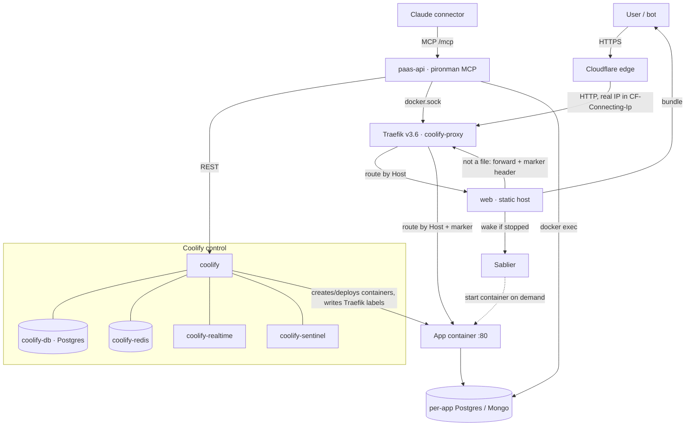
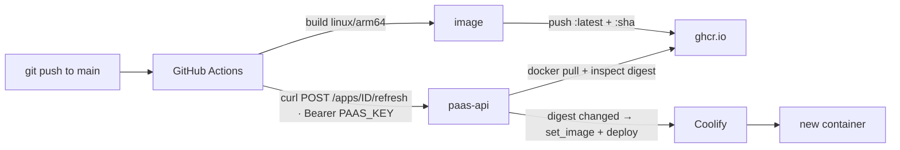

# Pironman — Raspberry Pi PaaS architecture

This document describes the self-hosted platform that `paas-api` (this repo, aka
**pironman** / the "Prionman" MCP server) controls. It doubles as memory for
future work and as a replication guide for anyone wanting to build the same thing
on their own hardware.

The short version: a **Raspberry Pi 5 at home runs [Coolify](https://coolify.io)
as a mini-Heroku**. Each app is a Docker container with an automatic HTTPS URL.
`paas-api` is a thin FastAPI control plane on top of Coolify that also exposes
every operation as an **MCP server**, so an LLM (Claude, via a claude.ai
connector) can deploy and operate the whole box conversationally. Traffic enters
through Cloudflare → Traefik, apps scale to zero when idle (Sablier), deploys are
automated end to end (CI pushes an image; the box notices and redeploys
itself), and
traffic analytics are harvested automatically from the shared proxy log.

---

## 1. Hardware & host

- **Raspberry Pi 5**, `linux/arm64`. This is the single most important
  constraint: **every image must be built for arm64** or it pulls fine and then
  dies with an exec-format error.
- Raspberry Pi OS. One disk (SD/SSD) — disk is the real capacity ceiling, not
  RAM or CPU.
- Docker Engine, with the Docker socket (`/var/run/docker.sock`) as the universal
  control surface — Coolify, Traefik, Sablier and `paas-api` all drive Docker
  through it.

> **Gotcha — `docker stats` shows 0 RAM.** Raspberry Pi OS ships with the kernel
> **memory cgroup controller disabled**, so Docker cannot report per-container
> memory (CPU still works). Fix once: add `cgroup_enable=memory cgroup_memory=1`
> to the single line in `/boot/firmware/cmdline.txt` and reboot.

### Where things live on the host

| Path | What |
|---|---|
| **`/opt/paas/`** | **This repository, cloned on the Pi.** The working copy on the box. |
| `/opt/paas/app/cronmatch.py` | Imported directly by `paas-cron-dispatch` via `sys.path` |
| `/usr/local/bin/pdb` | Database provisioning helper, also bind-mounted into `paas-api` |
| `/usr/local/bin/paas-cron-dispatch` | Host cron dispatcher (every minute) |
| `/usr/local/bin/paas-watchdog` | Host liveness watchdog (every 5 minutes) |
| `/var/lib/paas-watchdog/state.json` | Watchdog's edge-trigger state |
| `/var/log/paas-cron.log`, `/var/log/paas-watchdog.log` | Their output |
| `/usr/local/bin/docker-destroy-log` | Records every container **destroy** event (§9) |
| `/etc/systemd/system/docker-destroy-log.service` | Runs it, `Restart=always`, enabled at boot |
| `/var/log/docker-destroy.log` | Its output — rotated weekly, kept 8 weeks |

`/opt/paas` is the path to reach for from `host_run_script` (§5b): it is where a
`git pull` happens, where the host-side scripts are copied *from*, and the only
place on the box where this code exists as files rather than as a built image.

That distinction matters and is easy to get wrong. The host scripts are
**copied** to `/usr/local/bin`, not run from the clone — so editing
`/opt/paas/paas-cron-dispatch` changes nothing until it is copied over, and a
`git pull` alone never updates them:

```sh
cd /opt/paas && git pull
sudo cp paas-cron-dispatch paas-watchdog /usr/local/bin/
```

`paas-api` itself is the opposite: it runs from a **built image**, so the clone
is not what serves requests and editing files there has no effect on the running
control plane. Only CI and a redeploy change that.

---

## 2. The stack, top to bottom



**Request path:** Cloudflare terminates TLS and forwards HTTP to Traefik
(`coolify-proxy`). Because we're behind Cloudflare, the **real client IP is in the
`CF-Connecting-Ip` header**, not the socket. Traefik routes by `Host` to the app
container on **port 80** — or, for an app with a frontend or one that sleeps, to
the **static host**, which serves the bundle and forwards the rest (§9b). A
sleeping app is started by the static host calling Sablier directly (§9c), not by
the Traefik plugin: the plugin cannot help, because Traefik has no route to a
stopped container in the first place. The caller waits a few seconds; there is no
"starting" page.

**Control path:** Coolify owns the lifecycle (create/deploy/delete containers,
generate Traefik labels, provision databases). `paas-api` is a facade over
Coolify's REST API plus direct Docker/DB access via the mounted socket.

---

## 3. Containers on the box

| Container | Role |
|---|---|
| `coolify` | The Coolify app (orchestrator + UI/API) |
| `coolify-db` | Coolify's own Postgres |
| `coolify-redis` | Coolify queue/cache |
| `coolify-realtime` | Websockets for the UI |
| `coolify-sentinel` | Coolify host metrics agent |
| `coolify-proxy` | **Traefik v3.6** — the edge proxy, with the Sablier plugin |
| `sablier` | `sablierapp/sablier` — scale-to-zero controller (:10000) |
| `<uuid>-<timestamp>` | An **app** container. The name is the Coolify resource uuid + a deploy timestamp, so **it changes on every deploy** |
| `api` (`paas-api`) | **This control plane.** Also an app, but self-managing |

App container names look like `khmhpu3k4rd7a6vwzfq3t922-151340268225`. The stable
identity is the **uuid prefix** (`coolify_uuid` in the `apps` table); the suffix
changes each redeploy — a fact that matters for anything that references a
container by name (see the Sablier gotcha in §9).

Renaming them is not an option: Coolify manages containers by that name and would
regenerate it on the next deploy. Instead they are made *resolvable* — the
Coolify application is named after the app id at creation, and every custom-label
write stamps `pironman.app=<app-id>` on the container. `tools/papps` uses those
to list containers by app name, state and restart policy.

---

## 4. Networking & domains

- Every app is published at **`https://<app-id>-coolify.bogdanripa.com`**
  (`DOMAIN_SUFFIX = -coolify.bogdanripa.com`). Wildcard DNS + Cloudflare, so
  creating an app needs no DNS/cert/proxy step.
- **App ids become hostnames**: lowercase, alphanumeric + hyphens, one flat
  label, fixed at creation.
- Coolify stores app origins as `http://…` (not https): Cloudflare terminates
  TLS at the edge, and https here would make Traefik redirect-loop.
- **Apps must listen on port 80 on BOTH IP families** — not 3000/8080 (→ 502).
  Two clients connect from opposite directions, so each wrong bind fails
  differently:
  - **IPv4-only (`0.0.0.0`)** — the in-container healthcheck hits `localhost`,
    which resolves to `::1` first, is refused, and Coolify rolls the deploy back
    even though the app serves fine externally.
  - **IPv6-only** — the healthcheck passes and the container reports *healthy*,
    but Traefik connects to the container's IPv4 address, is refused, and every
    request 502s. The nastier failure: healthy container, dead site.

  Node's `listen(80, '::')` is dual-stack. **Python's is not** — asyncio sets
  `IPV6_V6ONLY`, so `uvicorn --host ::` listens on IPv6 only. Bind it explicitly:
  `socket.create_server(("::", 80), family=AF_INET6, dualstack_ipv6=True)` and
  pass the fd to uvicorn (see `web/run.py`). Port 80 is privileged → run as root.
  Verify from *outside* the container; `localhost` will lie to you.

---

## 5. The control plane (`paas-api` / pironman)

A FastAPI app (this repo) that:

1. **Wraps Coolify** (`app/coolify.py`) — create/delete/get app, set image, set
   env, deploy, set healthcheck.
2. **Exposes everything as MCP** (`fastapi-mcp`, mounted at `/mcp`) so the
   claude.ai connector can call each operation as a tool. Tool name = FastAPI
   `operation_id`; description = summary + docstring.
3. **Talks to Docker directly** via the mounted socket for things Coolify doesn't
   expose — container logs/stats, image digest checks, `docker exec` into
   database containers, and (`host_run_script`, §5b) a root shell on the host.
4. Runs **background loops**: hourly auto-update sweep, ~2 min analytics
   ingestion, ~2.5 min alert check.

It runs *as one of its own apps* (`api`), which is why it can redeploy itself
(§8) — the recursive part of the design.

### MCP transport gotchas (hard-won)

`fastapi-mcp` 0.4.0's defaults don't work with the claude.ai connector proxy.
`app/main.py` patches the SDK session manager to force:

- **`stateless=True`** — the control plane redeploys *itself* constantly, and MCP
  sessions live in memory; any stateful session dies on redeploy and every later
  call fails with "Invalid content from server". Stateless makes each tool call
  self-contained.
- **`json_response=False`** — answer as SSE (`text/event-stream`), which the
  connector proxy expects.
- The middleware that promotes `?key=` → `Authorization` header is **pure ASGI**,
  not Starlette `BaseHTTPMiddleware`, because the latter buffers/mangles the SSE
  stream and the proxy then rejects it.
- Server `version` is a real semver and the long description lives in
  `instructions` — the connector chokes if the whole description blob lands in
  `serverInfo.version`.
- Tools are annotated read-only / write / destructive (`ToolAnnotations`) so the
  connector UI groups them instead of dumping everything in "Other tools".

### Two rules for the control plane's own logs

**The connector key must never reach a log line.** claude.ai connectors cannot
send an `Authorization` header, so the key rides in the `/mcp` query string —
and uvicorn logs the full path, which put a working **admin** key in plaintext in
this container's log, where `apps_logs api` hands it to anyone who asks. A
`logging.Filter` on `uvicorn.access` redacts `key=` at the record, so it covers
every path rather than the ones someone remembered to sanitise.

**A background loop must never fail silently.** The loops swallow exceptions on
purpose — a bad analytics pass cannot be allowed to take the control plane with
it — but a bare `pass` makes a broken ingester indistinguishable from a quiet
one. That is exactly how "last accessed" read `never` for apps in daily use with
nothing anywhere to say why. They log the traceback (`main._swallow`), which
uvicorn captures, so `apps_logs api` shows it — and the healthcheck's own
successful access-log lines are filtered out, or the 10-second cadence would push
that traceback out of `--tail` within about two minutes.

### 5b. Getting out of the container (`host_run_script`)

The control plane is a container, so a host-level shell is not a `subprocess` —
it has to be built out of the only surface it has, the mounted Docker socket.
`app/hostexec.py` runs a throwaway `--privileged --pid=host` container and
`nsenter`s into PID 1's mount/UTS/IPC/net/PID namespaces, which lands `sh` in the
host's own namespaces — the Pi's filesystem, network and process table, as root.
The helper container carries the `nsenter` binary and contributes nothing else,
which is why it defaults to paas-api's **own image** (already on the box, so no
pull; `HOST_EXEC_IMAGE` overrides).

Three things there are easy to get wrong, and were:

- **`env -i`.** nsenter passes the *caller's* environment through, so without it
  a script's `env` prints this control plane's `COOLIFY_TOKEN` and
  `PAAS_DB_PASSWORD`, and inherits a PATH with no host sbin dirs.
- **`cd /` inside the shell, not `nsenter --wd=/`.** nsenter opens that directory
  before entering the mount namespace, so `--wd=/` lands the script in the
  *container's* root — the one place it must not be.
- **Two timeouts.** The host-side `timeout` bounds the script and lets the helper
  exit cleanly; an outer wait force-removes the container when it does not, since
  killing the `docker run` client leaves the container running.

This is the platform's escape hatch, not its front door: `apps_logs`, `apps_stats`
and `db_run_script` cover their ground better, and this is a root shell on the
machine all of them run on. It is admin-key-only (deploy keys are confined to
their three deploy routes by `require_key`) and tagged destructive so the
connector prompts.

### Auth

`api_keys` table (sha256 only). Two kinds:

- **Admin keys** (`app_id` NULL) — full access; the bootstrap key and the
  connector `?key=` are these.
- **Deploy keys** (`app_id` set) — scoped to one app, may only
  `PUT /apps/<id>/code`. Handed out freely as an app's CI secret; a leak can only
  redeploy that one app to an already-published image.

---

## 6. Databases

- **`_paas` registry** — a Postgres database (created out-of-band with
  `pdb create _paas`) holding `paas-api`'s own tables: `apps`, `api_keys`,
  `shared_env`, `app_env`, `crons`, and the analytics/alerts rollups. The Postgres
  **host is resolved live** (`pdb host --engine postgres`) because Coolify
  recreates DB containers and the name changes.
- **Per-app databases** — provisioned on request via the host **`pdb`** script
  (mounted read-only into `paas-api` and invoked over the Docker socket). One
  shared Postgres container and one shared Mongo container back all app DBs; each
  app gets its own database + user. The connection string is injected as
  **`DATABASE_URL`** into the app on every deploy (recomposed each time — never
  hardcode it). `db_run_script` / `db_size` reach an app DB by
  `docker exec`-ing `psql`/`mongosh` into the shared engine container.

> `api` shows no DB size in `apps_stats` because it has **no attached app
> database** — it uses `_paas`, which lives outside the per-app attach model, so
> its `apps` row has no `db_engine`.

### Self-migrating schema

`app/db.py` holds a `_SCHEMA` of `CREATE TABLE IF NOT EXISTS` /
`ALTER TABLE … ADD COLUMN IF NOT EXISTS` run at every startup — so a new feature
(env vars, analytics, alerts) needs **no manual SQL on the Pi**.

---

## 7. Environment variables

Two scopes, both stored in `_paas` and injected on deploy:

- **Shared** (`shared_env`, tools `env_*`) — account-wide, applied to every app.
  Single-owner box, so cross-cutting secrets (e.g. an OpenAI key) live here.
- **App-specific** (`app_env`, tools `apps_env_*`) — one app; overrides a shared
  var of the same name.

Effective env = shared, overlaid by app-specific, plus platform-managed
`DATABASE_URL`. Setting/removing a var redeploys the affected app(s). Values are
**write-only** — listings show a masked preview only.

---

## 8. Deploy pipeline

Apps deploy with one repository secret, `PAAS_KEY`, which the platform installs
itself:



1. CI builds an **arm64** image, pushes to `ghcr.io` tagged `:latest` (+ `:sha`).
2. CI calls `POST /apps/<id>/refresh` with the app's scoped `PAAS_KEY`.
3. `paas-api` pulls the watched tag through the host Docker daemon, and **only if
   the image digest actually moved** re-points Coolify at the new image and
   redeploys. Also runs **hourly** regardless.

Deploys are **verified**: Coolify rolls a failed deploy back silently, leaving
the previous container serving while every signal reports success, so
`autoupdate.verify_deploy` confirms the container was actually replaced and came
up healthy. `/refresh` and `/code` return 502 when it was not (CI goes red), and
the hourly sweep alerts. The control plane is exempt — it cannot watch its own
replacement.

`/refresh` accepts no caller-supplied image — it only makes the box re-check the
tag it already watches — so the key is defence in depth rather than the only thing
standing between a caller and an arbitrary deploy. `apps_deploy_workflow`
returns the exact GitHub Actions YAML + Dockerfile rules to wire this up. A
private-registry digest check needs one server-side credential
(`GHCR_USER`/`GHCR_TOKEN`) — one platform credential, not a per-app secret.

`api` itself is the exception: it deploys via the **authenticated**
`apps_update_code` path with a scoped deploy key, and is opted out of
auto-update, so a self-deploy is deliberate.

---

### Two deploys of one app must not overlap

Coolify's deploy call is asynchronous, so two overlapping calls for one app do
not queue — the second starts against a config the first is still changing, and
which container survives is a coin toss. This is not hypothetical: an app whose CI
ships a frontend and a backend runs both jobs at once, and the frontend upload
can itself rewrite routing labels and redeploy.

There is exactly one control-plane process, so an in-process lock is enough
(`app/locks.py`). Two scopes: `app_lock(id)` at every API entry point that
redeploys one app, and `ROUTING_LOCK` inside the route sync, which touches the
shared static host and therefore every app at once. Locks are taken only at the
outermost layer, and `ROUTING_LOCK` → `app_lock(web)` is the only nesting, always
in that order — asyncio locks are not reentrant, and a deploy path that deadlocks
is worse than one that races.

**CI needs the same guarantee one level up.** Every run pushes the same `:latest`
tag, so two overlapping runs race and the one that *finishes* last wins,
regardless of which commit is newer — and an arm64 build under QEMU emulation can
take anywhere from a minute or two for a small `node:*-slim`-style image to 15+
minutes for a large one or one that compiles native dependencies, so a quick
follow-up commit can easily land first and then be undone by its predecessor.
Every workflow this repo ships or scaffolds carries a `concurrency` group with
`cancel-in-progress`.

That spread is worth stating both ways round, because the old flat "~15 minutes"
figure was also quoted in `apps_deploy_workflow`'s output, and a caller who
believes it builds a twenty-minute polling loop around a run that finishes in
under two. Neither number is a default to plan against: watch the run, or time
the app's first build and use that.

---

## 9. Scale-to-zero (Sablier)

Idle apps are stopped and started on demand by **Sablier**, integrated as a
**Traefik plugin** (`experimental.plugins.sablier` in the proxy's static config)
plus the `sablier` container (Docker provider, watching `/var/run/docker.sock`).
A request for a sleeping app hits the Sablier middleware, which starts the
container (using its Coolify healthcheck to tell "started" from "ready") and
serves a brief waiting page.

**Enrollment is the fragile part, and the cause of a real outage-of-absence we
hit:** an app is enrolled by attaching the Sablier middleware to its Traefik
router. If that enrollment lives anywhere Coolify regenerates — the default
router labels, or a hand-edited file under `/data/coolify/proxy/dynamic/` —
then **the next deploy wipes it and the app silently stops sleeping** (stays
"Up" forever with zero traffic). Because container names carry a deploy
timestamp, enrolling by container **name** breaks on every redeploy for the same
reason.

**Durable design (implemented in `app/sablier.py`):** `paas-api` reads the app
container's **current labels straight off the running container** (Coolify's
complete generated set — nothing to reconstruct), adds `sablier.enable=true` +
`sablier.group=<app-id>` and a Sablier plugin middleware keyed on the **stable
app id** (not the volatile container name), prepends that middleware to every
Traefik router chain, and writes the whole set back as Coolify **read-only custom
labels** (`is_container_label_readonly_enabled`) so Coolify stops regenerating
them and the enrollment survives every redeploy.

**On host reboot:** nothing special is needed. Coolify creates app containers
with `restart: unless-stopped` (only Coolify's own containers use `always`), so
Docker leaves a container Sablier deliberately stopped alone and restarts the
ones that were running. Sleeping apps come back asleep and wake on their first
request. `apps_get` reports the live policy in `backend.runtime.restart_policy`
if it ever needs checking.

**One write, not two.** The enrollment and the static host's marker condition
(§9b) both live in the same label set, and both are read-modify-writes against the
container's *live* labels. A Coolify deploy is asynchronous, so a second write
moments after the first still reads the OLD container and silently reverts it —
which would leave an app routed but not sleeping, or sleeping but not routed, with
nothing to say so. `routing.apply_backend_labels` is the single place that
computes and writes both.

**Drift is repaired, not assumed away.** Because this Coolify build rejects the
read-only flag, a regeneration can drop the enrollment while `sablier_enrolled`
stays true in the database — the app just quietly stops sleeping. The hourly sweep
runs `sablier.reconcile`, which compares the database's belief against the
container's actual labels and re-applies.

### A deleted container is fatal — a *stopped* one is fine

This is the distinction the whole feature turns on, and getting it wrong cost a
nine-hour outage nobody noticed.

Sablier discovers an app through the `sablier.group` label, and that label lives
**on the container**. Stop the container and everything still works: Sablier's
Docker provider lists stopped containers, finds the group, and starts it on the
next request. **Delete the container and the group has no members at all** — the
wake request 404s (`Group not found`), the name-based fallback 500s
(`No such container: <app>`), and every request to the app is 502/503 **for ever**.
Only a deploy recreates a container, so nothing short of one recovers the app.

**What was deleting them: Coolify's forced Docker cleanup.** `DockerCleanupJob`
runs `docker container prune` with four negative filters, intending "spare proxies
*or* databases *or* applications *or* services":

```
docker container prune -f --filter "label=coolify.managed=true" \
  --filter "label!=coolify.proxy=true"       --filter "label!=coolify.type=database" \
  --filter "label!=coolify.type=application" --filter "label!=coolify.type=service"
```

Docker **ANDs** them. `matchLabels` spares a container only when *every* `label!`
pair matches, and nothing can be `coolify.type=database` **and** `=application`
**and** `=service` at once. The exclusion therefore never fires and **every stopped
`coolify.managed=true` container is deleted.** Prune only touches stopped
containers, and the only apps ever stopped are the sleeping ones — which is exactly
why both enrolled apps died and `api`/`web` never did.

> **`force_docker_cleanup` must stay `false` on this box.** With it true the job
> bypasses the disk threshold and runs unconditionally (nightly, `0 0 * * *`),
> deleting every slept container. False still cleans up at
> `docker_cleanup_threshold` (80%), and the disk sits at 3% of 470GB. Turning it
> back on in the Coolify UI silently re-arms this. It is an upstream Coolify bug,
> not a misconfiguration here.

**Two layers stand behind that**, because the trigger is upstream and the next one
may not be the prune:

- **Recovery.** `sablier.reconcile` checks container **existence before labels** —
  `_current_labels` returns `{}` when there is no container, so the old
  `if not labels: continue` skipped precisely the case that cannot fix itself. A
  missing container is redeployed, with re-enrollment left to the next pass since
  those labels are read off a container that does not exist yet. It runs at
  paas-api **startup as well as hourly**: the hourly loop sleeps *first*, and a
  control plane that redeploys more often than hourly restarts that timer every
  time, so a repair left behind it would never run at all.
- **Forensics.** Docker keeps no event history — its stream is in-memory and rolls
  over in minutes, so a container that vanishes overnight leaves nothing to read
  the next morning. `docker-destroy-log.service` (§1) appends every destroy event
  to `/var/log/docker-destroy.log`, turning reconstruction-by-inference into one
  `grep`.

### New deploys start asleep

`sleep_when_idle` used to be quietly untrue until an app's first request. Sablier
only stops instances it holds a **session** for, and sessions are created by
requests arriving through its middleware — **never by a deploy**. An app deployed
but not yet called therefore had nothing to expire and stayed up for ever.

`autoupdate.sleep_after_deploy` stops it once the deploy is confirmed good. Three
guards, each blocking a distinct way this could strand an app:

- **After verification, never before.** `verify_deploy` is what distinguishes a
  good deploy from Coolify's silent rollback, and it can only tell them apart while
  the container runs. `check_and_update` therefore sleeps only when `verify=True`.
- **Not when enrollment just ran** — that write queues a redeploy of its own, which
  would start the container straight back up.
- **Only when the app is actually enrolled.** Enrollment is what makes an app
  wakeable; stopping an unenrolled one leaves nothing able to start it again.

- **Default: every app sleeps** when idle (`apps.sleep_when_idle`, default true).
- **`api` is hard-excluded** (`SABLIER_EXCLUDE`) — it runs the ingester,
  auto-update sweep and alert loop and must never sleep.
- **`apps_sablier`** toggles it per app (reads base labels → enroll/unenroll →
  redeploy). Requires the app to have deployed once (so its labels exist).
- **`SABLIER_AUTO_ENROLL`** (default off, **`true` on this box**) makes new/updated
  apps enroll automatically after deploy, once verified. Config: `SABLIER_URL` (how
  Traefik reaches Sablier), `SABLIER_SESSION_DURATION`, `SABLIER_STRATEGY`.
- **Scale-to-zero is not offered at creation.** `apps_create` has no
  `sleep_when_idle` field — the column defaults true and `apply_image` sets it
  explicitly when a backend first appears — so every app made through the MCP tools
  sleeps. `apps_update sleep_when_idle=false` is the deliberate opt-out afterwards,
  and it is how an app is marked always-on alongside the `SABLIER_EXCLUDE` set.

> Verify enrollment on one app (`apps_sablier <app> true`) — confirm it sleeps
> when idle and wakes on request — **before** flipping `SABLIER_AUTO_ENROLL` on,
> since a wrong `SABLIER_URL` would break routing for every enrolled app. With it
> on, a not-yet-enrolled app's first deploy redeploys twice: once for the code, once
> for the enrollment labels.

---

## 9b. Frontends (static bundles + shared host)

An app can be a **backend** (docker image), a **static frontend** (a zip of built
assets), or **both** — they share one hostname.

Frontends are not containers. A CI job builds the assets, zips them and `PUT`s
them to `/apps/<id>/frontend`; `paas-api` unpacks the zip into a shared volume
(atomic staging + directory swap, so no half-written site) and the **shared static
host** (`web/`, an always-warm app, Sablier-excluded) serves them. A frontend
deploy is ~1 second and restarts nothing.

**Request resolution — one rule, nothing to configure:** a bundle answers only
reads, and only for files it actually has.

1. not GET/HEAD → backend (a bundle cannot answer writes)
2. a file in the bundle → serve it (`/` resolves to `index.html`/`index.htm`)
3. not a file, no backend → nothing has it (below)
4. not a file, backend exists → **backend, and its answer stands**
5. backend said 404 → nothing has it (below)

**A path nobody has is a 404.** If the bundle ships a `404.html` it is served,
with a 404 status, so an app owns how "not found" looks; a caller asking for JSON
keeps the backend's real error instead. An app whose **client-side router** owns
those paths opts in with `apps_update spa=true` and gets `index.html` back — no
redeploy, it is a manifest flag. That was the default once, and the cost was
steep: every typo answered 200 with the homepage, no app could show its own 404
page, and a broken link was indistinguishable from a working one.

OAuth callbacks, download links and server-rendered pages need no declaration:
they are simply GETs the bundle does not have, so they reach the backend like
anything else. An earlier design intercepted them as "navigations", served
`index.html`, and needed a per-app exception list to undo itself — the exceptions
existed only because the heuristic created them. Step 5 is the one heuristic
left and it is bounded: it can only act on a request the backend has already
rejected, so `fetch`/XHR keeps the backend's real 404 instead of being handed
HTML. Cost: one round trip before a client-side deep link falls back.

**Redirects** (`apps.redirects`, `web/redirects.py`) are evaluated ahead of all
of the above — ordered, first match wins, `*` → `:splat` and `:name` segment
placeholders, 301/302/307/308, query string preserved, path or absolute-URL
targets. They need no redeploy, and an app with redirects but no bundle is routed
through the static host so they work for backend-only apps too.

Because it is same-origin, the frontend calls its API with a relative path: no
CORS, no API base URL, no cookie-domain juggling.

**Routing — the static host is the front door.** `app/routing.py` derives one
Traefik router per fronted app from the database and writes them onto the **static
host's** Coolify custom labels, so the app's Host resolves to `web`. An app is
fronted when it has a bundle, or redirect rules, or **a backend that sleeps** (see
§9c). It re-syncs after every frontend deploy, after an app is deleted, at startup
and hourly, and is a no-op when unchanged (a frontend deploy must stay a
one-second file swap, not a restart of the shared host).

An app that has both a frontend and a backend would then have two routers on one
hostname. They are told apart by a **marker header** (`X-Pironman-Backend`) that
only the static host sends: the backend's own router rule gains
`&& Header(...)` plus an explicit priority, so a browser matches the frontend
router and a forwarded request matches the backend's. The app therefore keeps its
**real hostname end to end**.

> That last point is not cosmetic. An earlier design renamed the backend's router
> to `Host: <app-id>.internal`. Traefik rewrites `X-Forwarded-Host` on that hop,
> so the backend computed its own public origin as `https://<app-id>.internal` and
> emitted it in OAuth discovery metadata, `WWW-Authenticate` challenges and
> redirects — none of which resolve. An app must not be able to tell it is behind
> the static host.

The order of the two writes is deliberate: the static host's routers first, then
the backends are scoped, and only after the static host has verifiably come back
up. Scoping a backend is what stops it answering its hostname unconditionally, so
doing it first — or into a host still restarting — leaves the app answering
nowhere. Reversed, the worst case is that both routers match, the backend's longer
rule wins, and the app serves exactly as it did before.

> Coolify here rejects the readonly-labels flag (`422 … field is not allowed`),
> so the routers are written **unprotected** — a Coolify label regeneration can
> drop them. The startup and hourly re-syncs put them back, since the label set is
> derived from the database.

*Verified end to end:* frontend-only app created with no image → files published
→ route created automatically → served over HTTPS.

## 9c. Waking a sleeping app

**Traefik's Docker provider only sees running containers.** When Sablier stops
one, its router disappears — and so does the Sablier middleware that was supposed
to wake it. The only route to a sleeping app exists exactly when the app does not
need it. Requests 404, nothing starts the container, and because "stopped" is also
what a healthy idle app looks like, nothing reports it: an app can be dead for
days and read as working-as-designed.

That is why every sleeping app is fronted by the static host, which never sleeps
(hard-excluded in `sablier.excluded`, not merely by config). The route always
exists because it lives on a container that is always up.

The static host forwards to the backend through Traefik, with the marker header
and the app's real Host. If the backend is stopped, Traefik has no router for it,
so the forwarded request matches the *frontend* router and arrives back at the
static host. It recognises its own marker, answers `503` + `X-Pironman-Backend-Down`,
and the forwarding side reads that as "asleep": it calls **Sablier's blocking API
directly** (`GET /api/strategies/blocking?group=<app-id>`), which starts the
container and returns when it is ready, then retries. Sablier's own Docker
provider lists stopped containers, so it can always find the group — it is only
Traefik that cannot.

By **group**, not by name: enrollment tags the container `sablier.group=<app-id>`,
a stable id, while its actual name is the Coolify uuid plus a deploy timestamp.
`?names=<app-id>` returns `500 … No such container` — verified on the box. The caller sees one slow request; there is no interstitial.

All of that holds only while the container **exists**. Sablier lists stopped
containers, so a slept one is always findable; a *deleted* one leaves the group
empty and the same request 404s `Group not found` and then 500s on the name
fallback — the two error shapes together are the signature of a deleted container,
not a sleeping one (§9). Verified end to end on the box: `docker stop` →
`Exited (137)`, request through the public host → `200`, container `Up`.

The one thing the static host must never do here is fall through to `index.html`.
An unreachable backend that answers with the site's homepage looks like a working
site — that is precisely how the failure above stayed invisible. It is a 502.

**Proxying rules the static host cannot break:**
- **Never strip `content-encoding`.** The body is forwarded exactly as it
  arrived, and both Traefik and Cloudflare compress. Dropping the header while
  passing the compressed bytes tells the browser to render a gzip stream as text
  — which is what an OAuth consent page looked like. Only responses over ~1KB are
  compressed, so JSON endpoints and healthchecks looked fine throughout.
- **Ask only for what the caller asked for.** The forwarded request advertises
  the caller's own `Accept-Encoding` (`identity` if it sent none), or httpx would
  request gzip on its own behalf and hand a compressed body to a client that
  cannot decode one.
- **Release a response you discard.** A `StreamingResponse` closes its upstream
  only when its body is iterated, so replacing a proxied response without
  `_release`-ing it holds an httpx connection open until garbage collection.

**CDN caching** is defended in layers, because a mis-cached API response is the
one failure that really hurts:
- **whitelist** at Cloudflare — cache only immutable asset paths, bypass
  everything else (a blacklist fails open; a whitelist fails closed);
- the static host sends **`Cache-Control: no-store, private`** on every proxied
  response, so a bad rule still can't cache an API reply;
- non-GET methods and `Set-Cookie` responses are never cached anyway;
- never enable Cloudflare **"Cache Everything"** — it overrides origin headers and
  is the classic cause of leaked API responses.

Verify with `CF-Cache-Status`: `DYNAMIC`/`BYPASS` on API paths, `HIT` on assets.

**One key for both halves:** the backend `/refresh` trigger and the frontend
upload both authenticate with the app's **scoped deploy key** (`PAAS_KEY`), which
can only deploy that one app. Because the key is that narrow, `/refresh` also
accepts the image CI just built — and on an app's **first** deploy that image is
what creates the Coolify application and its container. `apps_create` registers a
bare id on purpose (only the pipeline knows what the app runs), so without this
an app could be registered and then never deploy.

## 10. Analytics & observability

All cross-app analytics come from the **one place every app's traffic already
flows through: the Traefik access log** — nothing is installed per app.

- Traefik is configured to write a **JSON access log** and keep the
  `User-Agent` and `Cf-Connecting-Ip` headers (one-time proxy flags).
- `paas-api` tails the `coolify-proxy` container log over the Docker socket on a
  ~2 min loop (`app/analytics.py`), turning each request into a **cookieless
  visitor** = `sha256(salt | ip | user-agent)` — the app id is deliberately *not*
  in the hash, so one person across two apps is one visitor. Ingestion is
  idempotent via a `StartUTC` cursor.
- **The read window is capped and the exit code is checked** (`MAX_WINDOW`, 1h).
  Without both, one failed pass is permanent: `_docker` reports a timeout by
  *returning* `(124, "docker timed out")`, and discarding that code leaves a
  string with no JSON in it — indistinguishable from a quiet log. Zero lines
  counted, no error, cursor pinned, and the next pass asks for a larger window,
  which fails more easily. Every analytic on the box froze for twelve hours that
  way. A pass that counts nothing while the cursor falls behind now warns.
- Rollups in `_paas`: `analytics_visits` (per app/visitor/day, with an `is_bot`
  flag), `analytics_first_seen` (cohorts), `analytics_perf` (requests / 4xx /
  5xx / summed latency), `analytics_latency` (additive histogram → p50/p95
  without storing raw samples), `analytics_agents` (top raw user-agent strings),
  `analytics_last_seen` (each app's last request, to the second — the other
  rollups are day-keyed and cannot say how long an app has been idle).
- **Read-only MCP tools:** `analytics_overview` (uniques, hits, DAU/WAU/MAU,
  humans-vs-bots, per-app breakdown), `analytics_timeseries`, `analytics_cohorts`,
  `analytics_agents`, `analytics_recent` (live tail of raw requests), and
  `apps_stats` (per-app running state, live CPU/RAM, disk, DB size, error rate,
  p50/p95, last accessed, plus host CPU/RAM/disk headroom).
- A human dashboard runs as its own **frontend-only app** at
  `dashboard-coolify.bogdanripa.com` (`dashboard/` in this repo) — the platform
  dogfooding its own frontend feature: no image, no container, served by the
  static host and cached at the CDN. It reads the control plane cross-origin,
  which `app/cors.py` allows for the read-only analytics/stats paths only, and
  never for `/mcp`. It was kept off the control plane's hostname on purpose:
  routing `api` through the static host would put the control plane's
  availability behind another app.

**Analytics rows outlive the apps they describe.** They are keyed by the app id
seen in the access log and nothing deletes them when an app is deleted, so every
app that ever served a request is still in `analytics_visits`, `_perf`, `_agents`,
`_latency` and `_first_seen`. That is correct for a *report* — dropping the rows
would misstate history — but wrong for *navigation*: the dashboard's app filter was
built from `/analytics/overview`'s `per_app` and so offered long-deleted apps whose
only possible result is their own old traffic. It reads `/stats/apps` instead, which
comes from the `apps` table. The per-app traffic table still renders everything
analytics holds. `analytics_last_seen` is the one table that tracks live apps only,
which makes it a useful cross-check for orphans.

---

## 11. Alerting

`app/alerts.py` runs a background loop that messages **Telegram** when an app goes
**down**, **recovers**, or throws **new 5xx** errors. A consecutive-failure
debounce keeps rolling redeploys from looking like outages. Configure with
`TELEGRAM_BOT_TOKEN` + `TELEGRAM_CHAT_ID`; unset, the loop is a no-op.
`alerts_test` confirms delivery.

**The 5xx path is a sleeping app's only cover.** Such an app is never reported
down, because being stopped is the feature working — so if it fails to wake or
crashes on start, the errors its requests produce are the one thing that says so.
That check spent its whole life nested in a branch requiring an app to both sleep
*and* have been alerted down, which meant it had never fired for anything. Treat
it as load-bearing.

**For a sleeping app, check existence — never state.** A sleeping app is *supposed*
to be stopped, so "is it running" says nothing and alerting on it would fire every
idle night. Whether it still **has a container** says everything (§9). Every reader
of that state now makes the distinction:

| Reported | Means | Response |
|---|---|---|
| `asleep` | container exists, stopped | healthy — the next request wakes it |
| `missing` | **no container at all** | cannot wake; needs a redeploy |

- `paas-watchdog` no longer skips sleeping apps: it checks them with
  `docker ps -a` and reports a missing container within 5 minutes. Deliberately
  **not** `restartable` — there is nothing to `docker start`, and retrying that
  every five minutes would just fail forever.
- `stats.app_runtime` falls back to `docker ps -a` rather than inferring from the
  running-only `docker stats`; `stats.app_resources` does the same, reusing the
  `ps -a` listing it already fetches for disk sizes, so the list view costs no
  extra Docker call.

Reporting a deleted app as `asleep — the next request wakes it` is what let the
outage in §9 run for nine hours unseen: an app fronted by the static host still
answers `200` on `/` while its backend is unreachable, so there was no external
symptom and the platform's own status agreed with it.

---

## 12. Hard-won lessons (checklist)

- **arm64 only** — an amd64 image pulls then dies with exec-format error.
- **Listen on `:80` bound to `::`**, run as root — anything else 502s or fails
  the localhost healthcheck and gets rolled back.
- **Real client IP is `CF-Connecting-Ip`** — behind Cloudflare the socket IP is
  the edge, not the user.
- **Enable the memory cgroup** or `docker stats` reports 0 RAM.
- **Anything Coolify generates, Coolify regenerates** — Sablier enrollment (and
  any custom route label) must live in Coolify `custom_labels`, keyed on the
  stable app id, not in a hand-edited file or a container-name reference.
- **MCP must be stateless + SSE** for the claude.ai connector, and the key-promote
  middleware must be pure ASGI.
- **Deploys go through CI, never hand-built images** — hand builds won't be arm64
  and won't reproduce; the box watches the registry itself.
- **The `api` control plane is special** — no auto-update, no scale-to-zero,
  authenticated self-deploy only.
- **Traefik's Docker provider only sees running containers** — a stopped app has
  no router, so anything that must survive the app being stopped (a wake path
  above all) has to live on a container that stays up.
- **Stopped and deleted are different states, and the platform must never conflate
  them** — a slept container wakes, a deleted one can only be redeployed. Anything
  that answers "is this app OK" by looking at `docker ps` sees the same thing for
  both. Ask `docker ps -a` (§9, §11).
- **`docker container prune`'s `label!=` filters are ANDed, not ORed** — a spare
  list of mutually exclusive labels excludes nothing at all. Coolify's forced
  cleanup deletes every stopped app container because of it; keep
  `force_docker_cleanup` false. Assume nothing about filter semantics: this one
  survived two confident wrong diagnoses and was settled only by creating a
  labelled throwaway container and running the exact command against it.
- **Instrument the disappearance, not just the symptom** — Docker's event stream is
  in-memory and rolls over in minutes, so "what deleted this overnight" is
  unanswerable after the fact. `docker-destroy-log.service` exists because the
  first investigation had to be reconstructed by inference.
- **A background repair behind a long `sleep` may never run** — the auto-update
  loop sleeps an hour *before* its first pass and the timer restarts on every
  redeploy of the control plane, which redeploys more often than that. Anything
  that must actually happen goes ahead of the sleep, not inside the loop.
- **Never let a failure be answered with something that looks like success** —
  an SPA fallback in place of an unreachable backend, a compressed body labelled
  as text, an internal hostname in otherwise valid metadata, a background loop
  swallowing its own exception. Every long debugging session here started with a
  green signal.
- **A shell "on the host" from inside a container inherits the container** —
  nsenter passes the caller's environment through and resolves `--wd` *before*
  the namespace switch, so a host shell needs `env -i` and a `cd /` run inside
  the shell, or it reads the container's secrets from the container's root (§5b).
- **Two writes to one label set is one write too many** — each is a
  read-modify-write against the live container, and a Coolify deploy is
  asynchronous, so the second reads the pre-deploy container and reverts the
  first.
- **The database records intent; the box records fact, and they drift** — an app
  row says `sleep_when_idle`, the container says whether it is stopped; the row
  says `sablier_enrolled`, the labels say whether the middleware is attached;
  `apps.image` says a tag, the running container says a digest. Every one of
  those pairs has been observed disagreeing. Diagnose from the box, not from the
  table, and treat the table as a claim to be checked. The same goes for reading
  the source: it describes what *should* happen on a fresh box, which is not the
  same as what this one is doing. See `CLAUDE.md` for the working rule and a
  table of the assumptions that turned out to be wrong.

**Checking it in isolation.** `web/tests/test_server.py` stands the real static
host up against a fake Traefik and a fake Sablier and drives the paths that have
actually broken: a woken backend, a dead one (which must 502, not quietly serve
the homepage), the 404 / `404.html` / `spa` fork, compressed passthrough and SSE
streaming. `deploy-web.yml` runs it before building the image.

**Checking it from outside.** `.github/workflows/verify.yml` (workflow_dispatch)
asserts these against the live box as a real client sees them: the static host
404s its own hostname, a frontend-only app serves its bundle and its deep links,
a frontend+backend app serves the bundle at `/` while its backend answers on the
same public hostname, no discovery metadata names an unreachable host, a proxied
body decodes, and `/mcp` is answered by the app rather than by the homepage. Run
it after any routing, proxy or Sablier change — none of those failures show up in
a status code.

---

## 13. Replicating this from scratch

1. **Hardware:** Raspberry Pi 5, arm64 OS, Docker. Enable the memory cgroup
   (`/boot/firmware/cmdline.txt`).
2. **Coolify:** install it; create one project + server + destination. Note the
   project/server/destination uuids.
3. **DNS/TLS:** point a wildcard `*-coolify.<your-domain>` at the box through
   Cloudflare (proxied). Coolify's Traefik gets certs via Let's Encrypt / CF.
4. **Edge proxy:** the Traefik `coolify-proxy`. Turn on the JSON **access log**
   keeping `User-Agent` + `Cf-Connecting-Ip` (for analytics), and load the
   **Sablier plugin** for scale-to-zero.
5. **Sablier:** run `sablierapp/sablier` with the Docker provider.
6. **Databases:** a shared Postgres and (optionally) Mongo container; a host
   `pdb` script to create/drop/host per-app databases. Create the `_paas`
   registry DB.
7. **Control plane:** deploy this repo as an app (`api`), mounting the Docker
   socket and `pdb`. Set the env in `.env.example` (Coolify uuids, `PAAS_DB_*`,
   `DOMAIN_SUFFIX`, optional `GHCR_*`, `GITHUB_TOKEN`, `TELEGRAM_*`,
   `ANALYTICS_*`). Bootstrap one admin key.
8. **Connect Claude:** add a claude.ai custom connector pointing at
   `https://api-<suffix>/mcp?key=<admin-key>`. Set read-only tools to
   always-allow.
9. **Ship apps:** for each new app, `apps_create`, then drop the
   `apps_deploy_workflow` output into its repo. Push to main → CI builds arm64,
   pushes to ghcr, calls `/refresh`, the box redeploys itself. No secrets.

---

*Kept as living memory. When the platform's behavior changes, update this file in
the same PR.*
